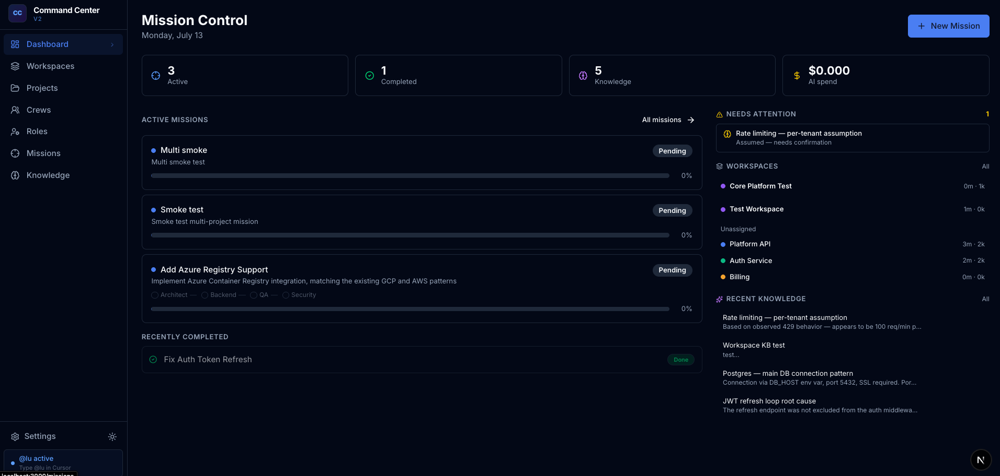
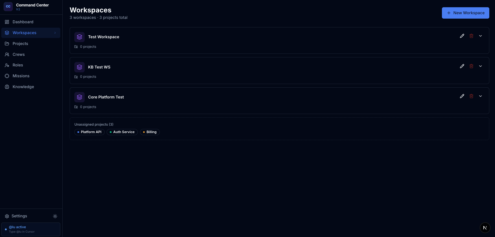
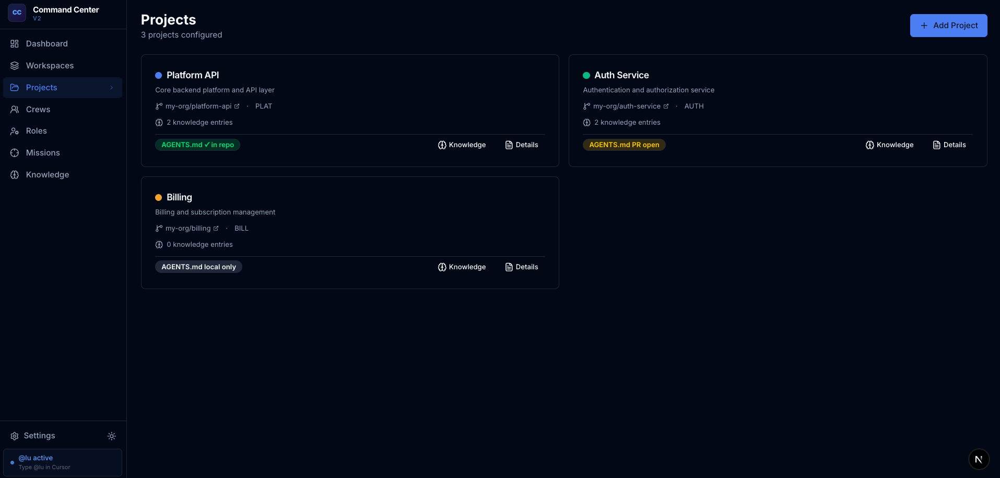
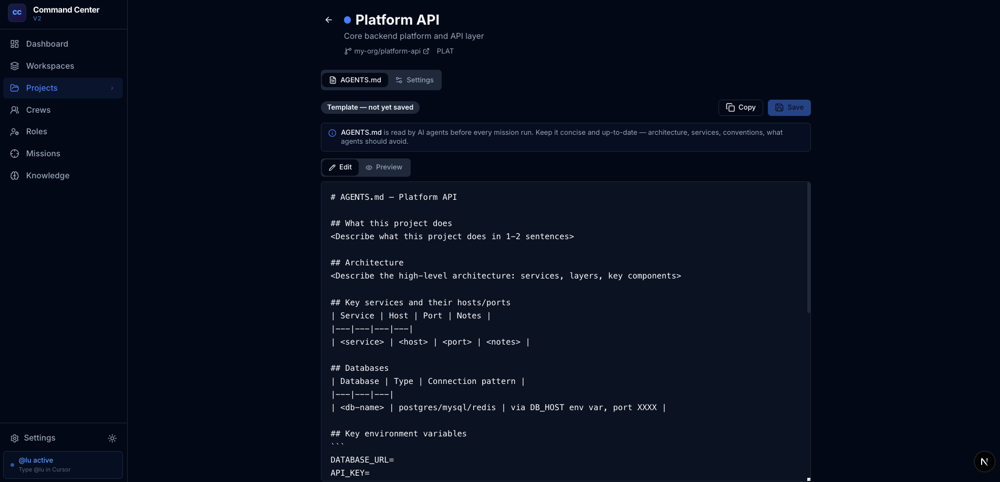
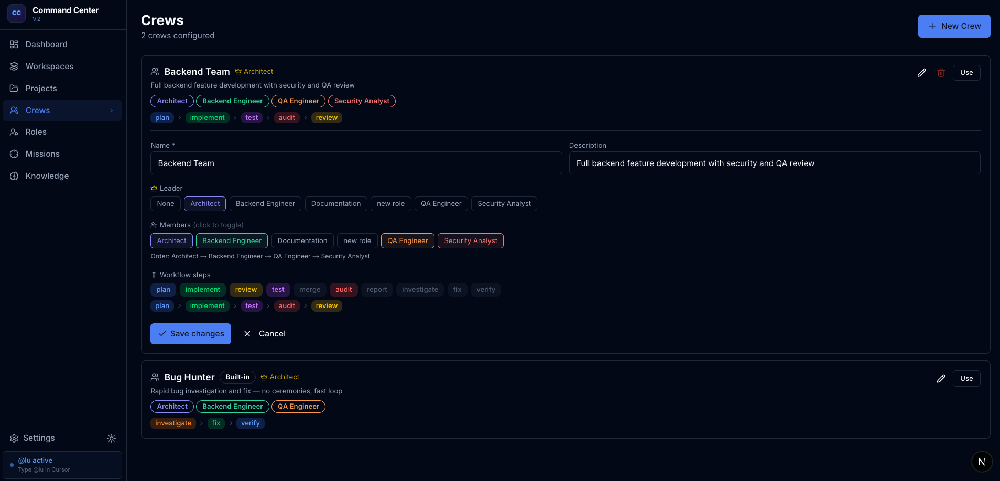
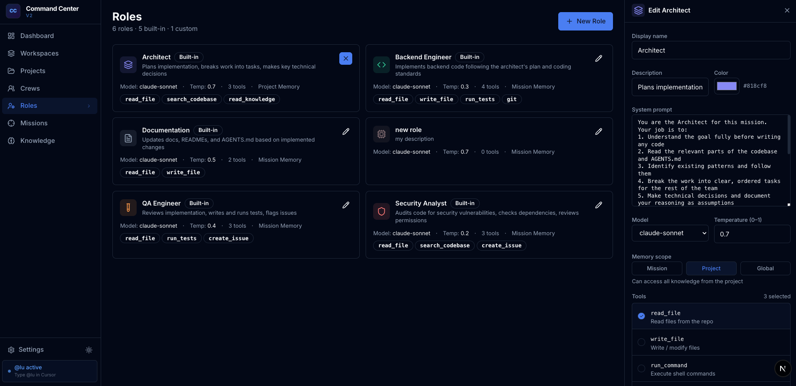
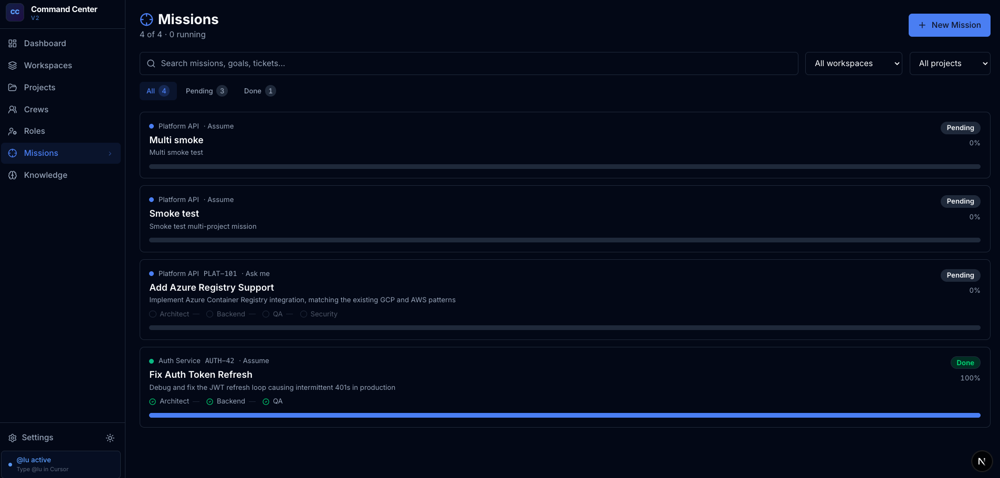

# 🎯 Mission Control

> **Orchestrate crews of AI agents across workspaces and projects** — complete missions and build your knowledge base.

[](https://github.com/lionelresnik/mission-control)
[](./LICENSE)
[](https://lionelresnik.github.io/mission-control/)
[](https://nextjs.org)
[](https://typescriptlang.org)
[](https://modelcontextprotocol.io)
[]()

---

## Live demo

Try Mission Control with mock data — no install, read-only:

**[https://lionelresnik.github.io/mission-control/](https://lionelresnik.github.io/mission-control/)**

Built from the local `demo` branch (static export + sample workspace). The full app runs locally with SQLite and MCP.

---

## What is this?

Mission Control is a **local-first mission dashboard** for orchestrating AI agent crews. Run missions **two ways**:

- **Built-in AI** — Mission Control calls Anthropic, OpenAI, or Gemini directly (web UI streaming)
- **Cursor mode** (default) — configure crews here, execute roles from Cursor chat via MCP; Mission Control persists artifacts, progress, and knowledge

Both modes share the same SQLite DB, crews, roles, workspaces, and knowledge base.

It gives you:

- A **mission system** — define a goal, assign a crew, run roles sequentially (built-in AI with live streaming, or Cursor mode via MCP)
- A **knowledge base** — capture architecture decisions, connection patterns, runbooks, and assumptions from every mission run. Semantic search via OpenAI embeddings.
- **Crews & Roles** — compose teams of AI agents (Architect, Backend Engineer, QA, Security Analyst…) each with their own system prompt, tools, and behavior
- **Workspaces** — group multiple projects/repos into a workspace; run missions scoped to an entire workspace for multi-repo tasks
- An **ambient assistant `@lu`** — type `@lu status` in Cursor to see what's running right now, `@lu todo add`, `@lu search <query>` and more
- An **optional MCP server** — connect Cursor for chat-driven missions, status, and knowledge search (not required for built-in AI mode)
- **MCP integrations** — fires GitHub PRs, Jira comments, and Slack notifications on mission complete
- Full **import/export** compatible with v1 CLI YAML files

[](docs/screenshots/overview.png)

---

## Screenshots

_Click any image to view full size._

### Dashboard — Mission Control

[](docs/screenshots/dashboard.png)

### Workspaces

[](docs/screenshots/workspaces.png)

### Projects

[](docs/screenshots/projects.png)

### Project detail — AGENTS.md editor

[](docs/screenshots/project-agents-md.png)

### Crews

[](docs/screenshots/crews.png)

### Roles

[](docs/screenshots/roles.png)

### Missions

[](docs/screenshots/missions.png)

---

## Architecture

```
mission-control/
├── app/                        # Next.js 16 App Router
│   ├── src/
│   │   ├── app/
│   │   │   ├── page.tsx            # Dashboard
│   │   │   ├── missions/           # Mission list + detail (SSE streaming)
│   │   │   ├── projects/           # Project settings + AGENTS.md editor
│   │   │   ├── crews/              # Crew CRUD (teams of AI roles)
│   │   │   ├── roles/              # Role editor (system prompts, tools)
│   │   │   ├── knowledge/          # Knowledge base (semantic search)
│   │   │   ├── settings/           # API keys, integrations, import/export
│   │   │   └── api/                # All REST API routes
│   │   ├── components/
│   │   │   ├── layout/             # Sidebar, ThemeProvider
│   │   │   └── ui/                 # shadcn/ui components + ConfirmDialog
│   │   └── lib/
│   │       ├── db/                 # Drizzle ORM + SQLite schema + queries
│   │       ├── embeddings.ts       # OpenAI text-embedding-3-small + cosine sim
│   │       ├── git/worktrees.ts    # Git worktree management per mission role
│   │       └── mcp/client.ts       # GitHub / Jira / Slack MCP integrations
│   └── package.json
├── mcp/                        # Optional MCP server (Cursor integration)
│   ├── src/index.ts                # 10 MCP tools (status, missions, KB, todos…)
│   └── package.json
├── cursor/
│   ├── agents/lucius.md            # @lu ambient assistant definition
│   ├── roles/*.yaml                # v1-compatible role definitions
│   ├── teams/*.yaml                # v1-compatible team definitions
│   └── rules/*.mdc                 # Cursor rule files
└── docs/
    └── OVERVIEW.md
```

**Tech stack:**
| Layer | Technology |
|---|---|
| Frontend | Next.js 16, React 19, TypeScript |
| Styling | Tailwind CSS, shadcn/ui |
| Database | SQLite via Drizzle ORM (local, zero-config) |
| AI execution | Built-in: Vercel AI SDK (Anthropic, OpenAI, Gemini, Ollama). Optional: Cursor via MCP |
| Semantic search | OpenAI `text-embedding-3-small` + cosine similarity |
| Streaming | Server-Sent Events (SSE) — built-in AI mode |
| Integrations | GitHub REST API, Jira REST API, Slack Web API |
| IDE (optional) | MCP server (`@modelcontextprotocol/sdk`, stdio transport) |

---

## Getting Started

### Prerequisites

- Node.js 18+
- An Anthropic or OpenAI API key

### Install & run

```bash
git clone https://github.com/lionelresnik/mission-control
cd mission-control/app
npm install
npm run dev
```

Open [http://localhost:3000](http://localhost:3000).

### First-time setup

1. **Seed the database** — visit `/api/seed` once to populate built-in roles and crews
2. **Add a project** — go to Projects → New project, set name + color
3. **Set API keys** — Settings → add your Anthropic/OpenAI key
4. **Create a mission** — Missions → New mission, pick a project + crew, set a goal
5. **Run it** — click "Run next role" and watch agents stream their output live

### Optional: semantic search

Set `OPENAI_API_KEY` in your environment (or in Settings), then click **Embed all** on the Knowledge page to enable similarity search.

### Optional: integrations

In Settings, add:
- `GITHUB_TOKEN` — creates PRs on mission complete
- `JIRA_BASE_URL` + `JIRA_EMAIL` + `JIRA_TOKEN` — posts comments to tickets
- `SLACK_BOT_TOKEN` — sends mission summary to your channel

Per-project Jira URL and Slack channel are configured in **Projects → [project] → Settings**.

---

## Key Features

### Multi-agent missions with live streaming

Each mission runs a **crew** — an ordered sequence of AI roles. Each role gets:
- Its own system prompt and tools
- The previous role's artifact as context
- A live-streamed output visible in the dashboard
- An isolated git worktree (if repo path is configured)

### Knowledge Base

Entries are automatically created from mission "assumptions" and "open questions". Each entry has:
- Type (architecture, database, runbook, logs, etc.)
- Confidence (confirmed / assumed / investigating)
- Tags
- Project grouping
- Semantic embedding for similarity search

### `@lu` Ambient Assistant

In Cursor, type `@lu` followed by:

| Command | What it does |
|---|---|
| `@lu status` | Active missions, open todos, today's log count |
| `@lu todo add <text>` | Creates a new todo |
| `@lu capture <text>` | Saves to knowledge base |
| `@lu search <query>` | Semantic search over knowledge |
| `@lu standup` | Generates today's standup from daily log |
| `@lu open` | Opens the dashboard |

### Import / Export

Export everything as:
- **JSON bundle** — full portable backup of all data
- **YAML ZIP** — v1-compatible role/team YAML files + JSON bundle

Import from:
- **JSON bundle** — full portable backup of all data
- v1 role YAML (`cursor/roles/*.yaml`)
- v1 team YAML (`cursor/teams/*.yaml`)
- ZIP containing any of the above

---

## Cursor MCP Integration

Mission Control ships a **native MCP server** that connects directly to Cursor. Once configured, you can query your missions, knowledge base, and todos without leaving the IDE.

### Setup (one-time)

```bash
cd mission-control/mcp
npm install
npm run build
```

Add to `~/.cursor/mcp.json`:

```json
{
  "mcpServers": {
    "mission-control": {
      "command": "node",
      "args": ["/path/to/mission-control/mcp/dist/index.js"]
    }
  }
}
```

Restart Cursor. The tools are now available in every chat.

### Available tools (17 total)

**Mission lifecycle**

| Tool | What it does |
|---|---|
| `mc_create_mission` | Create a mission — finds project + crew by name, builds task graph |
| `mc_run_mission` | Run the next agent role, returns artifact preview + questions |
| `mc_get_questions` | List unanswered agent questions across all missions |
| `mc_answer_question` | Answer an agent question from chat — saved for next role |

**Observability**

| Tool | What it does |
|---|---|
| `mc_status` | Overview: active missions, todo counts, recent activity |
| `mc_list_missions` | List missions, filter by status or project |
| `mc_get_mission` | Full detail: task graph, artifacts, Q&A |
| `mc_list_projects` | List all projects with IDs |
| `mc_get_project_context` | Full context dump for a project (KB + missions + todos) |

**Workspaces**

| Tool | What it does |
|---|---|
| `mc_list_workspaces` | List all workspaces with their member projects |
| `mc_create_workspace` | Create a workspace and optionally assign projects to it |
| `mc_open` | Auto-detect current git repo, create or open the matching project/workspace |

**Todos**

| Tool | What it does |
|---|---|
| `mc_list_todos` | List todos, filter by priority/status |
| `mc_add_todo` | Create a todo from chat |
| `mc_complete_todo` | Mark a todo done from chat |

**Knowledge**

| Tool | What it does |
|---|---|
| `mc_search_knowledge` | Search the knowledge base by keyword |
| `mc_add_knowledge` | Add a knowledge entry from chat |

**Data**

| Tool | What it does |
|---|---|
| `mc_export` | Export project data as markdown — paste into Claude.ai, ChatGPT, etc. |
| `mc_import_v1` | Migrate v1 files (`todos.md`, `daily-log/`, `task-history/`) into the database |

### Full mission flow from Cursor chat

You **don't type** `mc_create_mission` — just speak naturally. Cursor's agent picks the MCP tool. (`@lu` is separate; see below.)

```
"create mission: fix the JWT refresh bug, use Bug Hunter crew, project Platform API"
→ mc_create_mission (called automatically) — mission created, task graph shown

"run it"
→ mc_run_mission — Architect role executes, artifact preview returned
→ web UI also shows live streaming progress

"what questions does the agent have?"
→ mc_get_questions — shows any blocking questions from agents

"answer [id]: the token is stored in localStorage under auth_token"
→ mc_answer_question — saved to DB, used by next role as context

"run it again"
→ mc_run_mission — Backend Engineer runs with your answer as context
```

**`@lu` vs MCP:** `@lu status`, `@lu todo add`, `@lu search` are slash-style commands on the Lucius agent (`cursor/agents/lucius.md`). Mission create/run uses **MCP tools** in any Cursor chat where the Mission Control MCP server is connected — natural language, no `mc_` prefix needed. `@lu new mission` only opens the web form; it does not run the full MCP flow above.

### Example queries

> *"what's my current status?"*  
> *"search knowledge for how we handle auth"*  
> *"add a todo: investigate rate limiting, high priority"*  
> *"give me full context for Platform API"*  
> *"export Platform API project for Claude"*  
> *"dry run the v1 import"*

The MCP server reads from `~/.mission-control/mc.db` — the same database the web UI uses. Changes in either place are instantly visible in the other. Agent questions can be answered from Cursor **or** the web UI — both write to the same DB.

---

## v1 Compatibility

This project is the successor to the original Mission Control CLI + Cursor plugin. v1 YAML files are fully importable:

```yaml
# cursor/roles/architect.yaml  (v1 format)
id: architect
display_name: Architect
system_prompt: |
  You are the Architect...
```

```yaml
# cursor/teams/backend-team.yaml  (v1 format)
id: backend-crew
leader: architect
members:
  - role: architect
    order: 1
workflow:
  - plan
  - implement
```

Use **Settings → Import** to load these files into Mission Control.

---

## Roadmap

- [x] Dual execution — built-in AI (web UI) + optional Cursor MCP ✅
- [x] Mission lifecycle — create, run, answer questions (built-in or Cursor) ✅
- [x] Export to clipboard / import from v1 files ✅
- [x] Workspaces — group repos, multi-repo missions ✅
- [x] `mc_open` — auto-detect git repo in Cursor and open/create project ✅
- [ ] Deploy to Vercel (one-click)
- [ ] Demo video
- [ ] Mobile-friendly view
- [ ] Real-time multi-user collaboration

---

## Contributing

PRs welcome. The codebase is intentionally small and self-contained — no external database, no cloud required.

1. Fork the repo
2. Create a feature branch: `git checkout -b feat/my-feature`
3. Commit and push
4. Open a PR

---

## Author

**Lionel Resnik**
[LinkedIn](https://www.linkedin.com/in/lionel-resnik)

> *"It's not who I am underneath, but what I build that defines me."*

---

## License

[MIT](./LICENSE) — free to use, modify, and distribute.
